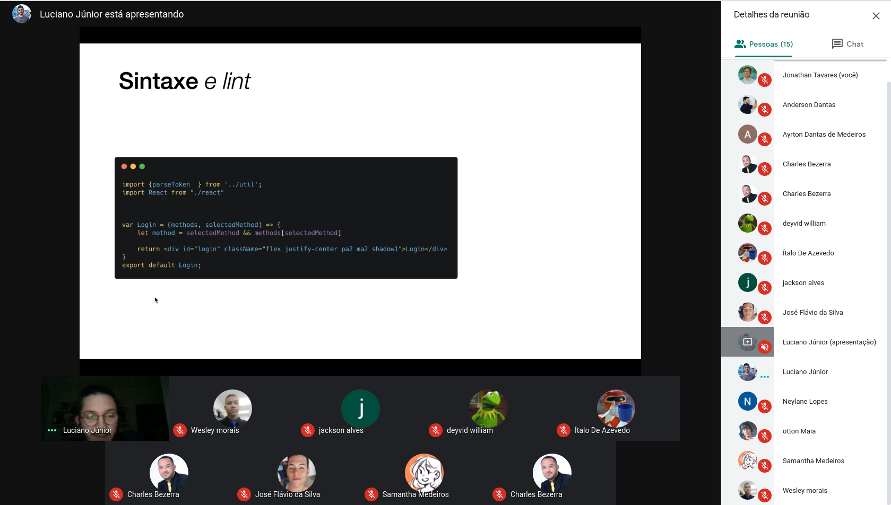

# Segundo MeetUp - Dev Seridó

- [x] Quando aconteceu?

- 11/jul do ano de 2020 das 17h às 18h30

- [x] Onde aconteceu?

- No [Google Meet](https://meet.google.com/czn-stix-imm)

- [x] O que foi abordado?

- Houve um bate-papo super construtivo sobre código limpo
- Dicas de como ser um melhor escritor
- Ferramentas que são utilizadas para auxiliar na escrita de um bom código

- [x] O que foi produzido?

 - [Apresentação sobre código limpo](https://drive.google.com/file/d/19J8JdQxrjUIemDm_p_KusMq40s7EIgR8/view)

- [x] Links Importantes 

 1. [GitHub do Luciano Jr.](https://github.com/lucis)
 2. [Vagas VTEX](https://careers.vtex.com/)

- [x] Quem participou?

- Jonathan Tavares 
- Anderson Dantas
- Ayrton Dantas
- Wesley Vitor
- Charles Bezerra
- José Flávio
- Ítalo de Azevedo
- Jackson Alves
- Luciano Jr.
- Neylane Lopes
- Samantha Medeiros
- Deyvid Willian
- Otton Maia
- Pedro Henrique
